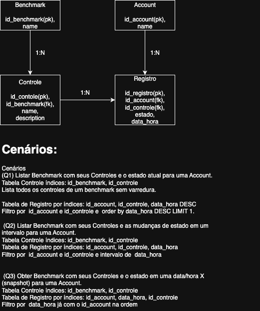

# 🚀 Desafio – Primeira Questão



# 🚀 Desafio – Segunda Questão

**REST API de Usuários (HTTP + CORS + Respostas)**

Este desafio consiste em implementar uma **API de leitura de usuários** seguindo boas práticas de arquitetura e padrões REST.

---

## 📋 Requisitos do Desafio

### Padrões a seguir

- **Respostas**: usar envelope com `data` e, quando aplicável, `pagination`.
- **Consultas**: suportar filtros, limites e ordenação.
- **Organização**: separar em camadas (`controllers`, `services`, `repositories`).
- **Boas práticas**: logs simples, variáveis de ambiente, documentação (`README`).
- **CORS**: habilitado apenas para origens confiáveis (ex.: `http://localhost:8080`).

---

# 🚀 Back-end JR

API simples de usuários em Spring Boot.

---

## 🔗 Endpoint público

A API está disponível em:

👉 [https://tinuvens.ddns.net/back_end_jr/api/usuarios](https://tinuvens.ddns.net/back_end_jr/api/usuarios)

---

## 🧪 Como testar online

Você pode usar o `curl` para verificar se o endpoint está respondendo:

```bash
# Lista de usuários
curl -i https://tinuvens.ddns.net/back_end_jr/api/usuarios

# Usuário por ID (exemplo com ID 1)
curl -i https://tinuvens.ddns.net/back_end_jr/api/usuarios/1

```

## 🧪 Como testar local

## Requisitos

- Java 21+,
  Para rodar este projeto é necessário ter o **Java 21 (JDK 21)** instalado.
  Você pode baixar no site oficial da Oracle:
  👉 [Download JDK 21 - Oracle](https://www.oracle.com/java/technologies/javase/jdk21-archive-downloads.html?utm_source=chatgpt.com)

- cURL para testar,
  Você pode baixar o cURL para qualquer sistema operacional no site oficial: 👉 https://curl.se/download.html

## Como rodar projeto

1. Execute a aplicação:

   - **Maven:** `./mvnw spring-boot:run`

     ou, mvn clean package para gerar JAR

   - **Jar:** `java -jar target/back_end_jr-1.0.0.jar`

> A API ficará em: `http://localhost:8080/back_end_jr`

## Endpoints

### Listar usuários (com filtros e paginação)

`GET /api/usuarios`

**Parâmetros opcionais**

- `isActive` (boolean): `true` ou `false`
- `role` (string): filtra pela role (case-insensitive)
- `q` (string): busca textual em `name` e `email`
- `createdFrom` (ISO local datetime): ex. `2024-05-01T00:00:00`
- `createdTo` (ISO local datetime): ex. `2024-06-01T00:00:00`
- `page` (int, default 0)
- `page_size` (int, default 10)

**Exemplos**

```bash
# por id
curl -i "http://localhost:8080/back_end_jr/api/usuarios/1"

# Todos
curl -i "http://localhost:8080/back_end_jr/api/usuarios"

# Apenas ativos
curl -i "http://localhost:8080/back_end_jr/api/usuarios?isActive=true"

# Por role
curl -i "http://localhost:8080/back_end_jr/api/usuarios?role=manager"

# Busca textual (name/email)
# Padrão conhecido: muita gente que consome APIs já espera um q para “full-text search”.
curl -i "http://localhost:8080/back_end_jr/api/usuarios?q=bruno"
curl -i "http://localhost:8080/back_end_jr/api/usuarios?q=fferraz2@contoso.dev"


# Intervalo de datas (created_at)
curl -i "http://localhost:8080/back_end_jr/api/usuarios?createdFrom=2024-05-01T00:00:00&createdTo=2024-06-01T00:00:00"

# Paginação
curl -i "http://localhost:8080/back_end_jr/api/usuarios?page=1&page_size=10"

# Combinado
curl -i "http://localhost:8080/back_end_jr/api/usuarios?isActive=true&role=manager&q=nogueira&page=0&page_size=5"

# Buscar por ID inexistente (404)
curl -i "http://localhost:8080/api/usuarios/99999"


```
